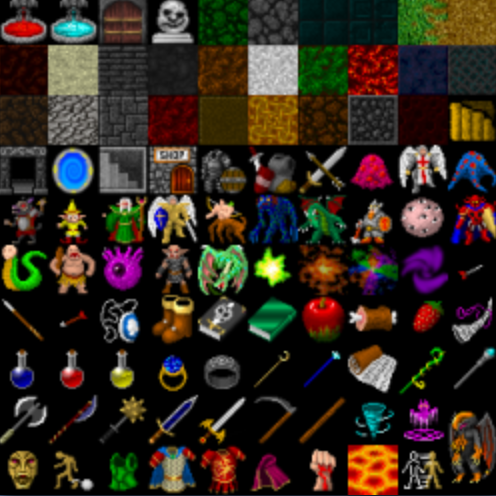
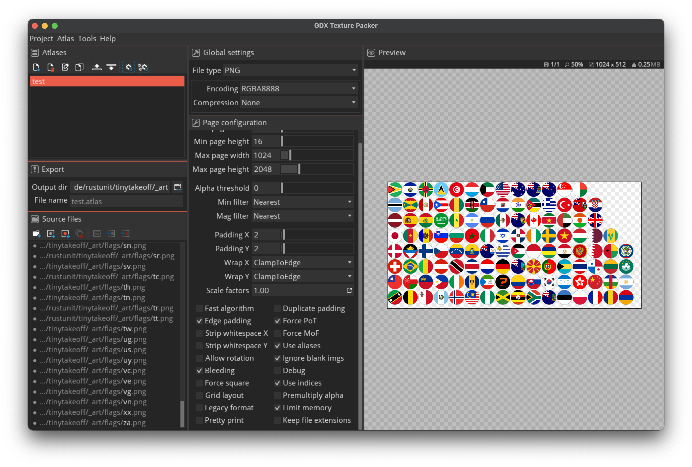
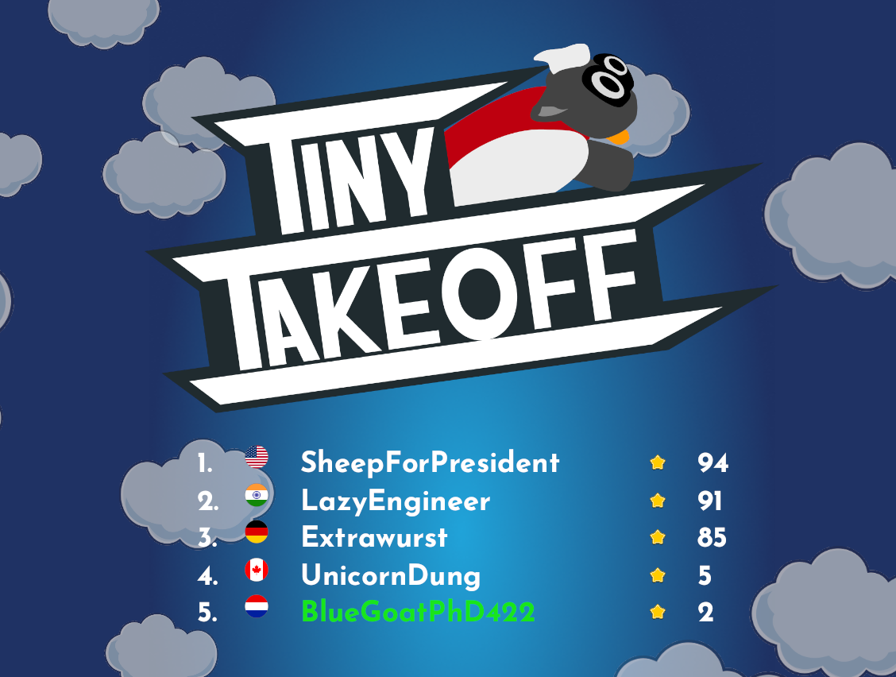

+++
title = "Using libgdx texture atlas in Bevy"
date = 2024-10-21
[extra]
tags=["rust","bevy","gamedev"] 
hidden = false
custom_summary = "What is a texture atlas? Learn how to generate and use one in Bevy"
+++

A texture atlas (used synonymously for sprite atlas and sprite sheet in the following) is an old and well-established tool in our game-dev toolbox. This article helps you understand what they are, why they are useful, and how to use them in a Bevy project.

# What is a texture atlas?

<a href="https://opengameart.org/content/dungeon-crawl-32x32-tiles" target="_blank"></a>
You have most certainly seen texture atlases before when using asset kits like the one on the right (taken from [opengameart.org](https://opengameart.org/content/dungeon-crawl-32x32-tiles)):

They come in many different formats, arrangements, and sizes. Some are square, some are not. Often, everything is arranged in a regular grid, but it could also appear as if it is a tightly packed chaos, where sometimes items are even rotated to pack as closely as possible.

Let's start with *why* we use them.

> Want to skip right to the chase? Find the [TL;DR](#tldr) at the end of the post.

# What is it good for?

Texture atlases in games serve the purpose of reducing *draw calls*. This is when a set of geometry uses the same material and can therefore be batched together and send to the GPU in one rendering call (aka draw call). I am simplifying here but one of the major reasons two pieces of geometry cannot be batched together are if they are using a different texture.

On hardware that only supports non-power-of-two textures using texture atlases allows you to reduce wasted memory. This is mostly an issue of the past unless you need to support arcane Adreno graphics chips (looking at you Android).

# How to use an atlas in Bevy ?


If we have an atlas arranged in a uniform grid like the above character animation (taken from the Bevy [assets](https://github.com/bevyengine/bevy/blob/5c759a1be800209f537bea31d32b8ba7e966b0c1/assets/textures/rpg/chars/gabe/gabe-idle-run.png)),
then using such an atlas is quite easy right out of the box in Bevy:

```rs
let texture_handle = asset_server.load("textures/rpg/chars/gabe/gabe-idle-run.png");
let texture_atlas = TextureAtlasLayout::from_grid(UVec2::splat(24), 7, 1, None, None);
let texture_atlas_handle = texture_atlases.add(texture_atlas);

commands.spawn((
    ImageBundle {
        //...
    },
    TextureAtlas::from(texture_atlas_handle),
));
```
> See this in action in this [Bevy example](https://bevyengine.org/examples/ui-user-interface/ui-texture-atlas/)

*Now how do we handle a texture atlas that is not arranged in a regular grid?*

Let's look at the definition of `TextureAtlasLayout`:

```rs
pub struct TextureAtlasLayout {
    pub size: UVec2,
    pub textures: Vec<URect>,
    /* private fields */
}
```

So the answer is: we just need to somehow list all the different rects that can be used as an individual texture in this big atlas.

This is where we have to figure out how to generate an atlas in the first place.

# How to generate an atlas?

There a two major ways to do this: **offline** and **online**.

**Online** means we combine textures at runtime into an atlas, for example when loading a level, choosing what textures will be needed and then combining them into a single texture atlas. Bevy supports doing that already using [TextureAtlasBuilder](https://docs.rs/bevy/latest/bevy/prelude/struct.TextureAtlasBuilder.html).

**Offline** means we want to author our texture atlas before shipping the game. This has the advantage of not having to pay the runtime costs of doing this. For assets where the use cases are clear this is obviously reducing loading times, CPU usage and peak memory usage on constraint platforms like mobile and web.

In this article, we deal with the **offline** case.

One mature tool that allows combining single textures into an atlas is [gdx-texture-packer-gui](https://github.com/crashinvaders/gdx-texture-packer-gui) originally developed for [libgdx](https://libgdx.com).



In the above screenshot you see the tool in action. We add a whole long list of source files on the left and the packer generates the packed texture on the right.

It also generates an `atlas` file that looks like this:

```atlas
flags.png
size:1024,512
repeat:none
ae
bounds:684,126,60,60
ag
bounds:64,250,60,60
ai
bounds:374,250,60,60
am
bounds:932,436,60,60
```

*This* is something we can have Bevy ingest as an `Asset`!

# How to load the generated libgdx atlas in Bevy?

Bevy allows us to load custom asset formats by implementing the `AssetLoader` trait like this:

```rust
#[derive(Default)]
struct CustomAssetLoader;
impl AssetLoader for CustomAssetLoader {
    type Asset = CustomAsset;
    type Settings = ();
    type Error = ();
    
    async fn load<'a>(
        &'a self,
        reader: &'a mut Reader<'_>,
        _settings: &'a (),
        _load_context: &'a mut LoadContext<'_>,
    ) -> Result<Self::Asset, Self::Error> {
        let mut bytes = Vec::new();
        reader.read_to_end(&mut bytes).await.unwrap();
        // load bytes from file here
        Ok(CustomAsset)
    }

    fn extensions(&self) -> &[&str] {
        &["custom"]
    }
}

fn main() {
    App::new()
        .add_plugins(DefaultPlugins)
        .init_asset::<CustomAsset>()
        .init_asset_loader::<CustomAssetLoader>()
        .run();
}
```

This snippet above leaves out how to parse the file format we have seen above but it illustrates how easy it is to register a custom asset loader for files with the extension `.custom`. Find the full example provided on the [Bevy website](https://bevyengine.org/examples/assets/custom-asset/).

We implemented a custom asset loader for the libgdx atlas format in the [bevy_libgdx_atlas](https://github.com/rustunit/bevy_libgdx_atlas) crate. The asset itself looks like this:

```rust
pub struct LibGdxAtlasAsset {
    /// The texture atlas image.
    pub image: Handle<Image>,
    /// The texture atlas layout.
    pub atlas: Handle<TextureAtlasLayout>,
    /// The map of the original file names to indices of the texture atlas.
    pub files: HashMap<String, usize>,
}
```

Now this allows us to lookup the original texture (like `us.png`) inside the `files` hashmap and use the associated index to set the texture used from the `TextureAtlasLayout` (remember the `textures` vector with the right bounds of the sprite?).

> Find a full example of how to use `bevy_libgdx_atlas` in the [repo's example](https://github.com/rustunit/bevy_libgdx_atlas/blob/main/examples/animation.rs).

# Further Thoughts

Bevy at some point will feature an extendable editor and then we can build something like Unity's [SpriteAtlas](https://docs.unity3d.com/Manual/sprite/atlas/workflow/optimize-sprite-atlas-usage-size-improved-performance.html) feature which will allow us to include the functionality of `gdx-texture-packer-gui` right into the Bevy editor. 

And if I may dream maybe we can even replicate the comfort of Unity allowing us to reference the original sprites in the editor and then under the hood adapt the references to use the regions inside the generated sprite atlas. *dreaming*

# TL;DR {#tldr}

We developed and published [bevy_libgdx_atlas](https://github.com/rustunit/bevy_libgdx_atlas) 
so everyone can just generate texture atlases using the libgdx format 
and [GUI tool](https://github.com/crashinvaders/gdx-texture-packer-gui) inside Bevy projects.

Find the flags example in action in our game [tinytakeoff.com](https://tinytakeoff.com):

<a href="https://tinytakeoff.com" target="_blank"></a>

You need support building your Bevy or Rust project? Our team of experts can support you! [Contact us.](@/contact.md)