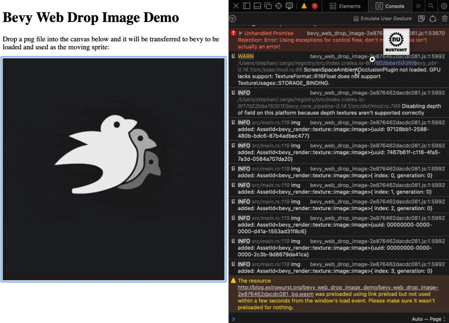

+++
title = "Drag & Drop Sprite into Bevy on the web"
date = 2024-11-27
[extra]
tags=["rust","bevy","web"] 
hidden = false
custom_summary = "In this post we talk about how to integrate web native APIs via WASM with Bevy."
+++

In this post we talk about how to integrate web native APIs via WASM with Bevy.

We utilize the recently released [bevy_channel_trigger](https://crates.io/crates/bevy_channel_trigger) crate, wasm-bindgen, web_sys and gloo.

If you just want to jump right into the code and tinker with it, find it on [GitHub](https://github.com/rustunit/bevy_web_drop_image_as_sprite).

# What is the use case?

In this example we want to allow the user to drop a *PNG* image into our Bevy app running in the Browser. The app should load the image into the Bevy Asset Machinery and display it like any other image file. See the animation to the right visualizing this.

The steps to making this work are:

1. Prepare the DOM to receive drop events
2. Handle Drop-Events (containing file data)
3. Forward events to Bevy
4. Receive and load image data in Bevy

## 1. Prepare the DOM to receive drop events

Lorem Ipsum Dolores Lorem Ipsum Dolores Lorem Ipsum Dolores Lorem Ipsum Dolores Lorem Ipsum Dolores Lorem Ipsum Dolores Lorem Ipsum Dolores Lorem Ipsum Dolores Lorem Ipsum Dolores Lorem Ipsum Dolores 

## 2. Handle Drop-Events

Lorem Ipsum Dolores Lorem Ipsum Dolores Lorem Ipsum Dolores Lorem Ipsum Dolores Lorem Ipsum Dolores Lorem Ipsum Dolores Lorem Ipsum Dolores Lorem Ipsum Dolores Lorem Ipsum Dolores 

## 3. Forward events to Bevy

Lorem Ipsum Dolores Lorem Ipsum Dolores Lorem Ipsum Dolores Lorem Ipsum Dolores Lorem Ipsum Dolores Lorem Ipsum Dolores Lorem Ipsum Dolores Lorem Ipsum Dolores Lorem Ipsum Dolores 

## 4. Receive and load image data in Bevy

Lorem Ipsum Dolores Lorem Ipsum Dolores Lorem Ipsum Dolores Lorem Ipsum Dolores Lorem Ipsum Dolores Lorem Ipsum Dolores Lorem Ipsum Dolores Lorem Ipsum Dolores Lorem Ipsum Dolores 

# Conclusion

Lorem Ipsum Dolores Lorem Ipsum Dolores 

---

You need support building your Bevy or Rust project? Our team of experts can support you! [Contact us.](@/contact.md)