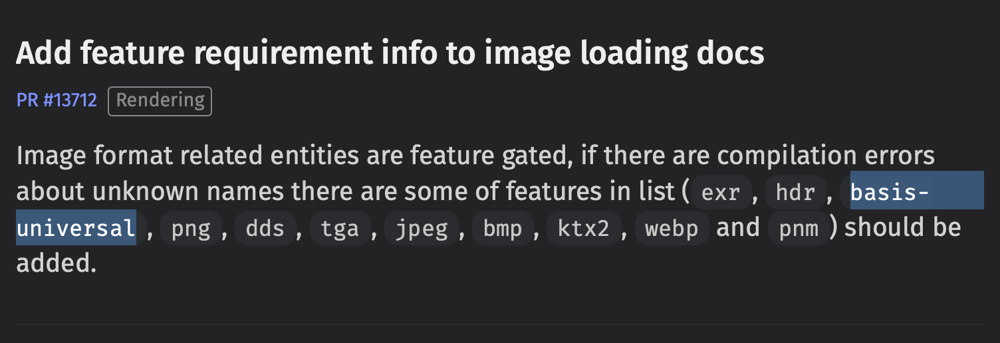

+++
title = "Rust Crate Feature Debugging"
date = 2024-12-12
[extra]
tags=["rust","bevy","cargo"] 
hidden = true
custom_summary = "Want to figure out what dependency enabled a feature which breaks your build?"
+++

In this short post, we will look at how we recently debugged a build breaking due to a *feature* being enabled on one of our dependencies that is not compatible with one of our build targets: **Wasm**.

# What Happened

After porting our Bevy-based game, [TinyTakeoff](https://tinytakeoff.com) to the newest Bevy release at the time of writing this, [0.15](https://bevyengine.org/news/bevy-0-15/), our build broke with the following error on **Wasm**:

```sh
cargo:warning=In file included from vendor/basis_universal/encoder/pvpngreader.cpp:14:
cargo:warning=vendor/basis_universal/encoder/../transcoder/basisu.h:53:10: fatal error: 'stdlib.h' file not found
cargo:warning=   53 | #include <stdlib.h>
cargo:warning=      |          ^~~~~~~~~~
cargo:warning=1 error generated.
```

Looks like some crate is trying to build C-code under the hood, which depends on `stdlib.h`. That is not a problem on native build targets, but it won't work on **Wasm**. 

This happens in the `basis-universal` crate. Wonder what that is for? Reading up on its [crates.io page](https://crates.io/crates/basis-universal), we can see that it is:

> Bindings for Binomial LLC's basis-universal Supercompressed GPU Texture Codec

Looking into the [Bevy Migration Guide for 0.14 to 0.15](https://bevyengine.org/learn/migration-guides/0-14-to-0-15) we find exactly one [place](https://bevyengine.org/learn/migration-guides/0-14-to-0-15/#add-feature-requirement-info-to-image-loading-docs) where it is mentioned:



So, this dependency is nothing that we need or want, given we are not making use of that image format. How did it get introduced into our dependencies in the first place?

Let's dive right in and find out!

# How to Find the Cause

We first want to find out _where_ in our dependency tree that `basis-universal` is brought in from. `cargo tree` is the tool to help you analyze your dependencies by showing them in a nifty graph structure. 

When running `cargo tree`, we get over 1.000 outputted lines that we have to parse, for somewhere inside this haystack is `basis-universal`:

```sh
│       │   ├── bevy_image v0.15.0
│       │   │   ├── basis-universal v0.3.1
│       │   │   │   ├── basis-universal-sys v0.3.1
│       │   │   │   │   [build-dependencies]
│       │   │   │   │   └── cc v1.2.3 (*)
```

We got a winner! It is used by `bevy_image`. The problem now is that we do not know why `bevy_image` is suddenly bringing this in. Based on the changelog linked above, we know it is supposed to be behind a `feature` flag on the `bevy` crate, called `basis_universal`. Looking at our `Cargo.toml`, we don't enable it.

> Cargo will enable the minimum subset of `features` needed so that every dependency using `bevy` gets the features they ask for.

The question therefore is, which crate enables this feature?

# Playing Cargo Feature Detective

There is a little-known feature in `cargo tree` that allows us to not only see our dependency tree, but also the features that are enabled in each crate that is pulled in. 

Running `cargo tree -e features` in our repository root, we get over 3.000 lines of this:

```sh
├── winit v0.30.5
│   ├── tracing v0.1.41
│   │   ├── tracing-core v0.1.33
│   │   │   └── once_cell feature "default"
│   │   │       ├── once_cell v1.20.2
│   │   │       └── once_cell feature "std"
│   │   │           ├── once_cell v1.20.2
│   │   │           └── once_cell feature "alloc"
│   │   │               ├── once_cell v1.20.2
│   │   │               └── once_cell feature "race"
│   │   │                   └── once_cell v1.20.2
│   │   ├── pin-project-lite feature "default"
│   │   │   └── pin-project-lite v0.2.15
│   │   └── tracing-attributes feature "default"
│   │       └── tracing-attributes v0.1.28 (proc-macro)
```

Luckily, we now know what feature we are looking for, `basis-universal`. So, let's search for `bevy feature "basis-universal"`:

```sh
├── bevy_libgdx_atlas feature "default"
│   └── bevy_libgdx_atlas v0.3.0
│       ├── bevy feature "basis-universal"
│       │   ├── bevy v0.15.0 (*)
```

There we go, and would you look at that? One of our own crates, `bevy_libgdx_atlas`, enables the feature `basis-universal`, which in turn enables the dependency `basis-universal`, which then breaks our build on **Wasm**. At least it being our own crate will make it easier to fix this time around. Funnily enough, it was used to enable `bevy_image` while trying to depend on the smallest subset of features of `bevy`. This is a known issue in Bevy 0.15, see [#16563](https://github.com/bevyengine/bevy/issues/16563), but, luckily, there is a cleaner workaround to this issue. You just need to enable the `bevy_image` feature in `bevy_internal` see [here](https://github.com/rustunit/bevy_libgdx_atlas/commit/20cb2e99ef8dd696dfbbff3ef120591cae82703b).

## Improving Ergonomics

In case you run into multiple crates enabling an unwanted feature, it can be more ergonomic to invert the tree using: `cargo tree -e features -p bevy --invert`.
With this command, we limit our root to `bevy`, and we will find *one* entry for the feature, and a subtree of dependencies using it:

```sh
├── bevy feature "basis-universal"
│   └── bevy_libgdx_atlas v0.3.0
│       └── bevy_libgdx_atlas feature "default"
│           └── tinytakeoff v0.1.1
```

# Conclusion

The feature option in `cargo tree` is a powerful tool in fighting against the subtle ways that dependencies, and the features enabled by them, can creep into your codebase.

Since it is close to Christmas, I want to make a small wishlist to improve the situation:

1. A `cargo deny`-like tool that allows me to whitelist, and or blacklist, features in dependencies.
2. `cargo tree` should generate a computer-readable format (RON, JSON, or whatever) to help with the first point.
3. In a perfect world, there would be a `cargo tree-tui` allowing me to interactively inspect dependencies, their features, and fan in (who uses it) and fan out (what it is using).

That being said, `cargo tree` seems underused, so go and run it on your Bevy project yourself and see what features of dependencies like Bevy you actually compile. This can have a huge impact on your Wasm binary size!

---

Do you need support building your Bevy or Rust project? Our team of experts can support you! [Contact us.](@/contact.md)
