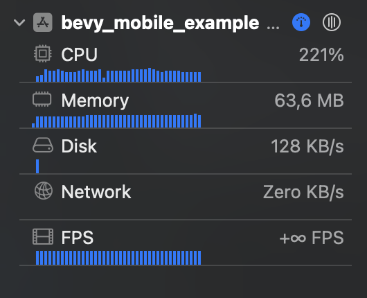

+++
title = "Bevy Efficiency on Mobile"
date = 2025-01-02
[extra]
tags=["rust","bevy","mobile"] 
custom_summary = "Limit refresh rate to conserve energy and reduce heat production."
+++



Mobile Games have to walk a fine line between rendering performance and energy conservation.

On the one hand a game is supposed to run smoothly which requires a high enough framerate and yet not to consume too much energy and therefore draining battery too quickly.

In this short post we talk about how to balance the two and how to adapt the balance based on your specific apps needs.

We will also find out why the default settings of Bevy on mobile used to lead to the worrisome statistics in the xcode debugger you see on the right - indicating that we run at ∞ fps and using 200% CPU 🥵.  

# Why mobile has to be treated differently

Traditionally games are rendered at the highest possible framerate. In case of PC and console games this means utilizing the hardware to the fullest maximizing fidelity, image and effect quality and overall richness of the experience.

On mobile however, the situation is different. The hardware is not only less powerful but also the device is not designed to be cooled actively. Instead the heat has to be dissipated through the case and the screen. This means that the device can get **hot** quickly. On the other hand the phone battery is another limiting factor. The more energy the game consumes the quicker the **battery** will be drained. As a phone user I don't want to suddenly change my charging habits just because I played my game.

> Thierry: And the game is again heating my device like crazy 😭

The Bevy engine is a general purpose game engine. It is not specifically designed for mobile games. This means that the default settings are not optimized for mobile. This is not a problem as long as you are aware of it and know how to adjust the settings.

# How to limit processing

So how to fix this problem? The short answer is: Limit the framerate.

The catch is though that your device might VSync at 60Hz already making you think the problem lies somewhere else. The foot-gun is that even if the rendering is limited to 60Hz Bevy will - by default - still update all your systems as often as it possibly can even if rendering updates are only happening in a 60 fps rate.

The solution is to configure the refresh rate of *winit*:

```rust
app.add_systems(Startup, init_refresh_rate);

fn init_refresh_rate(mut winit: ResMut<WinitSettings>) {
    winit.focused_mode = UpdateMode::reactive(Duration::from_secs_f32(1.0 / 60.0));
}
```

Using `UpdateMode::reactive` will lead to bevy refreshing our systems also based on user input like mouse events as they happen but in an absence of any event to *react* to it will limit the refresh rate to 60Hz. This is a sensible default for most mobile games.

But we can do better. We can adapt this at runtime.

# Adaptable framerate

In the above example we simply configure this 60Hz rate on startup. But you can adapt this at any time. This allows you to reduce the refresh rate in menus or more static situations and increase it during action phases where a low fps would lead to a reduced user experience.

A simple way would be to tie it to game states:

```rust
app.add_systems(OnEnter(GameState::FastAction), high_fps);
app.add_systems(OnExit(GameState::FastAction), low_fps);

fn high_fps(mut winit: ResMut<WinitSettings>) {
    winit.focused_mode = UpdateMode::reactive(Duration::from_secs_f32(1.0 / 60.0));
}

fn low_fps(mut winit: ResMut<WinitSettings>) {
    winit.focused_mode = UpdateMode::reactive(Duration::from_secs_f32(1.0 / 28.0));
}
```

This solution reduces the fps (and the logical update rate) to 28Hz when we are not in the `GameState::FastAction` state. 

This logic can be made more complex of course and allow temporary bursts when an animation is happening for a short period outside the `GameState::FastAction` state. The possibilities are endless.

# Conclusion

With Bevy *0.15* this solution became part of the official mobile example for more Bevy users to find: [Bevy PR #16548](https://github.com/bevyengine/bevy/pull/16548/files).

The problem and finding this solution was a coincidence when investigating a [regression](https://github.com/bevyengine/bevy/issues/16541) in Bevy *0.15* and it turned out that the machinery shown here to control refresh rate was in Bevy already since *0.14*.

---

Do you need support building your Bevy or Rust project? Our team of experts can support you! [Contact us.](@/contact.md)