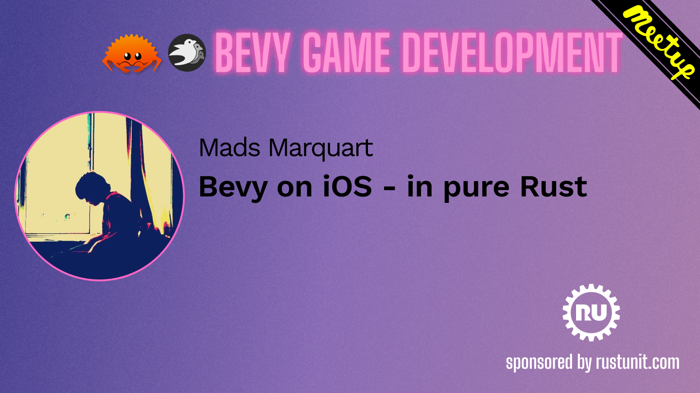

+++
title = "Dropping Swift from our Bevy iOS crates"
date = 2026-08-31
[extra]
tags=["rust","bevy","mobile"] 
hidden = true
custom_summary = "We removed the Swift packages from our bevy_ios_* crates, installing them is just cargo add now."
+++

In this short post we look at how we got rid of the Swift packages in our [bevy_ios_*](https://github.com/rustunit) crates.

Most of them we used to ship in a tandem: a Rust crate on [crates.io](https://crates.io) and a Swift package that you had to add to your xcode project via SPM. Over the last weeks we released them again, this time without that second half.

Installing them is now just `cargo add`.

# Why?

The language barrier itself did not go anywhere, we still cross it on every call. What changed is that we do not have to build and ship that crossing ourselves anymore.

The platform side lived in that package, written in Swift or Objective-C, and rust could only reach into it through C symbols. So every crate came with its own hand-written bridge and over the years we ended up with four different ones:

* `bevy_ios_safearea`: Swift functions exported as C symbols via `@_cdecl`
* `bevy_ios_alerts` and `bevy_ios_review`: hand-written Objective-C behind a C header
* `bevy_ios_notifications`: protobuf messages serialized across the C ABI
* `bevy_ios_gamecenter` and `bevy_ios_iap`: [swift-bridge](https://github.com/chinedufn/swift-bridge) plus a prebuilt `.xcframework`

They all had the same downsides:

* every one of our READMEs started with the xcode step of adding the SPM package, screenshot included
* the crate version and the package version had to match, that is why our install instructions said things like `bevy_ios_gamecenter = { version = "=0.6.0" }`. Get it wrong and you find out at link time.
* the swift-bridge crates also needed CI to build an `.xcframework`, zip it, hash it and attach it to a GitHub release on every version
* no simulator builds, `swift-bridge` pulls in `rust-bindgen` which broke `aarch64-apple-ios-sim` for us

# What replaced it

All of it is now [objc2](https://github.com/madsmtm/objc2) and its generated framework bindings: `objc2-ui-kit`, `objc2-user-notifications`, `objc2-game-kit` and `objc2-store-kit`. Apple's frameworks are Objective-C anyway, and unlike Swift, Objective-C has a dynamic runtime you can bind against generically: selectors, type encodings, `objc_msgSend`. That is what objc2 does for us under the hood, once, for every framework. The bridge is a dependency now instead of a second thing we ship.

<a href="https://www.youtube.com/watch?v=wv76dB2yATk"></a>

Mads Marquart, who maintains objc2, gave a talk about exactly this at our [Bevy Meetup #13](/bevy-meetup/bevy-meetup-13/#mads-marquart): *Bevy on iOS - in pure Rust*. Well worth a watch.

Our existing [bevy_ios_app_delegate](https://github.com/rustunit/bevy_ios_app_delegate) crate was built that way already. Now all the other crates are too.

> Our previous post on iOS deep-linking goes into detail on `bevy_ios_app_delegate` and what objc2 does for us there. You can find it [here](@/blog/2025/05-18-bevy-ios-deep-linking/index.md).

Lets look at the smallest crate first. `bevy_ios_safearea` used to be four Swift functions like this one:

```swift
@_cdecl("swift_safearea_top")
public func safeareaTop(view: UnsafeRawPointer) -> Float32 {
    let view = Unmanaged<UIView>.fromOpaque(view).takeUnretainedValue()
    return Float32(view.safeAreaInsets.top);
}
// ... and three more for bottom, left, right
```

plus their `extern "C"` declarations on the rust side, plus a `Package.swift`, plus the SPM step in your project. Today this is all it takes:

```rust
use objc2_ui_kit::UIView;

let view: &UIView = unsafe { &*ui_view.cast::<UIView>() };
let raw = view.safeAreaInsets();
```

# How does the platform call us back?

So far this is just rust calling into the platform. The other direction is what most of the protobuf and swift-bridge machinery was there for.

With objc2 we can define an Objective-C class in rust and hand it to UIKit as a delegate:

```rust
define_class!(
    #[unsafe(super(NSObject))]
    #[name = "BevyIosNotificationsDelegate"]
    struct Delegate;

    unsafe impl UNUserNotificationCenterDelegate for Delegate {
        #[unsafe(method(userNotificationCenter:willPresentNotification:withCompletionHandler:))]
        fn will_present(
            &self,
            _center: &UNUserNotificationCenter,
            notification: &UNNotification,
            completion_handler: &DynBlock<dyn Fn(UNNotificationPresentationOptions)>,
        ) {
            send_event(IosNotificationEvents::NotificationTriggered(
                notification.request().identifier().to_string(),
            ));

            let options = UNNotificationPresentationOptions::Banner
                | UNNotificationPresentationOptions::List
                | UNNotificationPresentationOptions::Badge
                | UNNotificationPresentationOptions::Sound;

            completion_handler.call((options,));
        }
        // ...
    }
);
```

The delegate above sends the Event off and calls the completion handler. `send_event` is our own little helper on top of [bevy_channel_message](https://github.com/rustunit/bevy_channel_message), it grabs the sender that our plugin put in place when it was built. So our Events end up in Bevy just like [before](@/blog/2024/11-15-bevy-channel-trigger/index.md).

All in all we deleted 2809 lines from `bevy_ios_notifications`, 1615 of them a single generated `Data.pb.swift` file. `bevy_ios_gamecenter` lost 4430 lines!

Remember the push notification token from the deep-linking post? It is done now.

Those tokens are only handed to the `UIApplicationDelegate`, so instead of swizzling from Swift we add those two callbacks to whatever delegate the app has and install our own if there is none. If `bevy_ios_app_delegate` already set one up we hook into that one.

# What changes for you

You don't have to add an SPM package anymore, no linking `GameKit` or `StoreKit` by hand and no screenshots in the README. There is just one version left to get right instead of two.

And `bevy_ios_gamecenter` and `bevy_ios_iap` build for the simulator again.

# What about StoreKit 2?

`bevy_ios_iap` is the one exception. StoreKit 2 is Swift only, there is no Objective-C runtime for objc2 to bind against, so here we are back to writing the bridge ourselves.

So this crate keeps a small Swift shim. But that shim now lives inside the crate: `build.rs` compiles it with `swiftc` and links it statically.

> The two sides talk over a hand-written C ABI carrying JSON.

Not pretty, but you still just `cargo add bevy_ios_iap` - no SPM package, no `.xcframework` release. This one is on `main` and not released yet.

# Releases

| crate | version |
| --- | --- |
| [bevy_ios_alerts](https://github.com/rustunit/bevy_ios_alerts) | `0.9` |
| [bevy_ios_gamecenter](https://github.com/rustunit/bevy_ios_gamecenter) | `0.7` |
| [bevy_ios_notifications](https://github.com/rustunit/bevy_ios_notifications) | `0.8` |
| [bevy_ios_review](https://github.com/rustunit/bevy_ios_review) | `0.7` |
| [bevy_ios_safearea](https://github.com/rustunit/bevy_ios_safearea) | `0.7` |
| [bevy_ios_iap](https://github.com/rustunit/bevy_ios_iap) | `0.11` (unreleased) |

# Conclusion

We did not change the public APIs much, `bevy_ios_notifications` is the exception here so check its changelog. If you are using any of these crates go and delete the SPM dependency from your xcode project and bump the rust one.

Thanks to the [objc2](https://github.com/madsmtm/objc2) crate for making all of this possible. Adding an iOS crate to your bevy game is just `cargo add` now!

---

Do you need support building your Bevy or Rust project? Our team of experts can support you! [Contact us.](@/contact.md)
