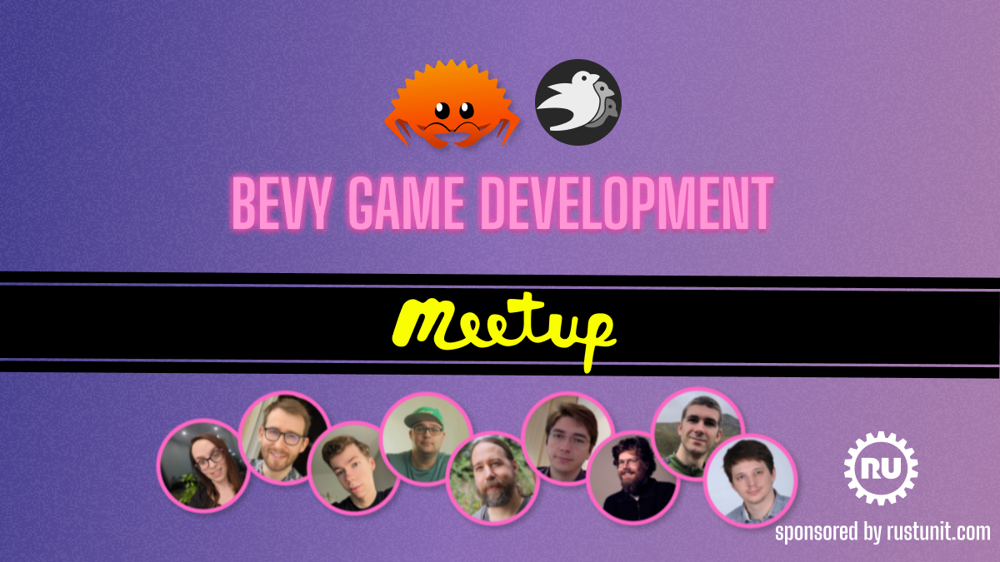

+++
title = "Virtual Bevy Meetups"
date = 2024-04-13
draft = false
[extra]
tags=["rust","bevy","gamedev"] 
+++

We are closing in on the third ever virtual [Bevy Meetup on April 18th](https://www.meetup.com/bevy-game-development/events/300167964/). Time to look back and review the goals set and achieved.

<!-- more -->

# Why

Starting a virtual Meetup seemed the natural next step for the growing and maturing community of the [Bevy Game Engine](https://bevyengine.org): More and more high quality projects are in development ([Jarl](https://www.jarl-game.com), [Times of Progress](https://store.steampowered.com/app/2628450/Times_of_Progress/), [Dead Money](https://www.deadmoney.gg)), lots of games released based on Bevy ([Cats Melon](https://apps.apple.com/app/id6478646325), [Geoguessr](https://apps.apple.com/us/app/geoguessr/id1049876497), our very own [Zoolitaire](https://zoolitaire)) and the [Bevy Foundation](https://bevyengine.org/news/bevy-foundation/) being established it felt like the right time to foster more Bevy focused conference-style content. 

> "The goal: Empower everyone in the community to interactively share."

There are plenty of great content creators on Youtube sharing amazing things about Bevy but a Meetup enables more people in the community to get a voice that do not want to start a Youtube or Twitch career.

Hosting and organizing this feels like providing a SaaS that is supposed to reduce the barrier for more folks to be able to talk about their fantastic projects and Bevy related content, whether this is a game, an non-game visual application or contribution to the ecosystem in any shape or form.

# How

* Remote

    The community is getting big ()

* live Q&A
* using Streamyard
* youtube live streaming
* HQ recording
* short but sweet

# Learnings

* less is more
* make it as easy as possible for presenters

# What

* recap of previous meetups