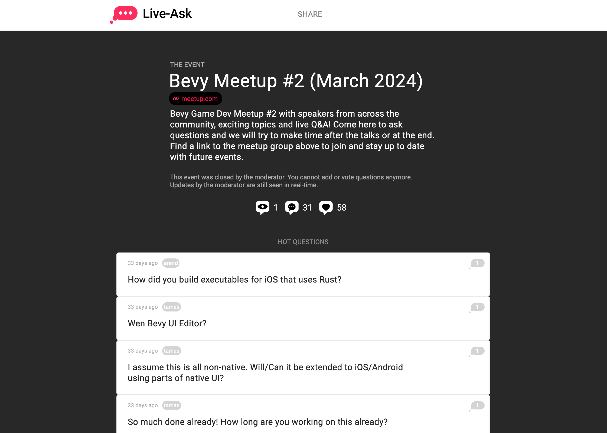

+++
title = "Virtual Bevy Meetups"
date = 2024-04-13
draft = false
[extra]
tags=["rust","bevy","gamedev"] 
+++

We are closing in on the third ever virtual [Bevy Meetup on April 18th](https://www.meetup.com/bevy-game-development/events/300167964/). Time to look back and review the goals set and achieved.

<!-- more -->

# Why

Starting a virtual meetup seemed the natural next step for the growing and maturing community of the [Bevy Game Engine](https://bevyengine.org):

* The engines Discord counts **~19k** members and **~33k** stars on Github.

* More and more high quality projects are in development: 

    * [Jarl](https://www.jarl-game.com)
    * [Times of Progress](https://store.steampowered.com/app/2628450/Times_of_Progress/)
    * [Dead Money](https://www.deadmoney.gg)
    * [Tiny Glade](https://store.steampowered.com/app/2198150/Tiny_Glade/) (uses only parts)

* A lot of games were already released based on Bevy: [Cats Melon](https://apps.apple.com/app/id6478646325), [Geoguessr](https://apps.apple.com/us/app/geoguessr/id1049876497), our very own [Zoolitaire](https://zoolitaire).

* Last but not least the [Bevy Foundation](https://bevyengine.org/news/bevy-foundation/) is now established.

It just felt like the right time to foster more Bevy focused conference-style content. 

> "The goal: Empower everyone in the community to interactively share."

There are plenty of great content creators on Youtube sharing amazing things about Bevy but a Meetup enables more people in the community to get a voice that do not want to start a Youtube or Twitch career.

Hosting and organizing this feels like providing a SaaS that is supposed to reduce the barrier for more folks to be able to talk about their fantastic projects and Bevy related content, whether this is a game, any visual application or contribution to the ecosystem in any shape or form (crate, tutorial, guide etc.).

# How

* **Remote & Online**

    The community is getting big (see above) globally and is very distributed, so naturally the first incarnation of a meetup is online to reduce the barrier of entry for everyone audience and presenters alike.

* **Live Streaming**

    Live Online Events have a bunch of options for how to conduct these events and by learning from prior art done for the [rust game dev meetup](https://www.youtube.com/@RustGameDevelopment) we chose to use [Streamyard](https://streamyard.com) which allows us to easily manage a live stage and backstage to get a seamless experience for the live stream audience plus great recording quality for later publishing.

* **No Zoom/GoogleMeet etc.**

    The choice against such tools was made for mostly three reasons: pricing, privacy and moderation. The downside is to not be able to easily give the audience an actual voice and face when engaging.

* **Live Q&A**

    

    There is not a lot of in person options for the community to engage with each other yet, so we still (despite the above point) wanted to provide a way to engange with each other. We are using [Live-Ask.com](https://live-ask.com) for the audience in front of the live stream to be able to engange with questions and vote them up for relevance. See the last events Q&A page: [here](https://www.live-ask.com/event/01HRS8ADB351EY3WS84YE83WJY).

* **Short Talks** (with the occasional exception)

    Too often the default for a presentation is 30 or even 45 minutes and not every topic needs that amount of time and still presenters will fill the time. This meetup goes the other way around and defaults to *short and sweet* **15min talks** with the occasionally exception for very indepth topics.

# Learnings

* **Less is more**

    The first meetup was very ambitous and the concept was not settled, in order to make sure we have an awesome line up a lot of potential speakers were contacted and a surprising number responsed to the calling. In hindsight this meetup should have been split in two but due to the excitement we ended up with a three hour marathon packed with so much great content that the dominant feedback afterwards was: please make it shorter next time (good problem to have i guess 😅)

* **Reduce speakers friction**

    The goal is to reduce and dismantle as much reasons to not present possible: 
    
    *No marketing required* - we bring the audience you bring the exciting content.

    *Reduce equipment needed* - dont worry about how to live stream or record, just use a good mic and decent internet we do the rest

    *Support with preperation* - need feedback on your slides, the content or just a pep talk that this will be awesome? we got you covered!

# Road ahead

### More amazing speakers

More interesting content, keeping up a well filled pipeline, so if you feel like presenting something, reach out! If you are not sure and you want to spitball ideas? Reach out! You know someone that we should reach out to? Reach out 😎

### Co-Hosts

Organizing this is fun but also work, work done for free. If you like the format and you want to support, lets talk! Also in order to have a fallback and the opportunity to present without moderating at the same time at some point.

### In-person conference

The vision is to eventually be able to lift this to the next level and start an in person BevyCon conference.

# Missed anything?

* Meetup #1 [January '24] [(playlist)](https://youtube.com/playlist?list=PLbvvWoCXmXkJHyozyLtWo83Y9B-6qqs0B)
* Meetup #2 [March '24] [(playlist)](https://youtube.com/playlist?list=PLbvvWoCXmXkJRb8fPcVV1hAhaZHaGC56v)