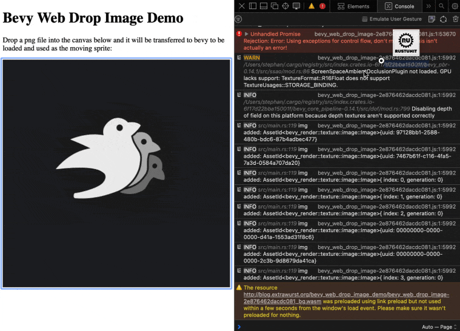

+++
title = "Drop an Image into Bevy on the Web"
date = 2024-10-25
draft = true
[extra]
hidden=false
tags=["rust","bevy","web"] 
custom_summary = "TODO"
+++

In this post we are going to look at how to allow dropping an image file onto your Bevy app running on the web and ingest that image as a Bevy asset and use it as a sprite

* step by step explanation of the `WebPlugin`
* link to issue with position of drop

